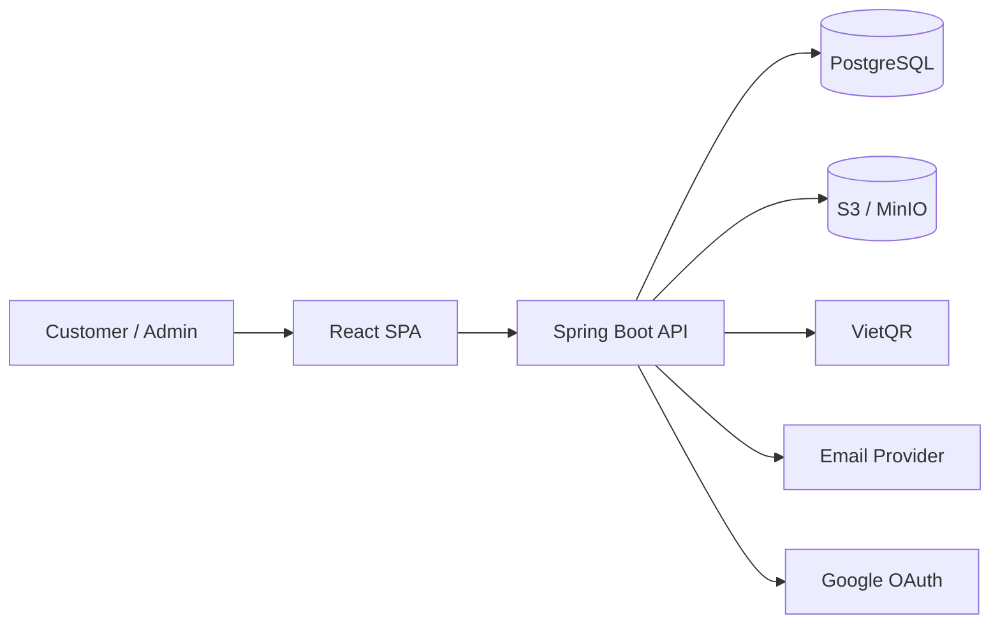

# Cutie Cuts

Cutie Cuts là một ứng dụng web full-stack cho salon/barbershop, kết hợp ba lớp trải nghiệm trong cùng một codebase:

- website public để giới thiệu thương hiệu, dịch vụ, barber và gallery
- khu vực khách hàng để đăng ký, đăng nhập, đặt lịch, mua sản phẩm và theo dõi lịch sử
- admin panel để vận hành booking, đơn hàng, nội dung và dữ liệu salon

## 1. Phạm vi sản phẩm

Từ những gì đang có trong code, hệ thống hiện bao phủ các nhóm nghiệp vụ chính sau:

- `Services`: danh sách dịch vụ, phân loại, giá, thời lượng
- `Barbers`: hồ sơ barber, kinh nghiệm, chuyên môn, đánh giá
- `Bookings`: đặt lịch theo dịch vụ, barber, ngày và khung giờ
- `Shop / Orders`: giỏ hàng, checkout, đơn hàng, lịch sử mua hàng
- `Payments`: tạo thanh toán QR, theo dõi trạng thái thanh toán
- `Reviews`: đánh giá cho booking và sản phẩm
- `Gallery`: ảnh salon / kiểu tóc / nội dung showcase
- `User profile`: hồ sơ cá nhân, xác thực, đồng bộ phiên đăng nhập
- `Admin operations`: dashboard, users, bookings, services, barbers, products, orders, gallery, reviews, settings

## 2. Trải nghiệm người dùng hiện có

### Public routes

- `/`
- `/services`
- `/shop`
- `/gallery`
- `/about`
- `/contact`
- `/auth`

### Protected customer routes

- `/booking`
- `/profile`
- `/my-bookings`
- `/my-orders`
- `/checkout`

### Admin routes

- `/admin`
- `/admin/users`
- `/admin/bookings`
- `/admin/services`
- `/admin/barbers`
- `/admin/products`
- `/admin/orders`
- `/admin/gallery`
- `/admin/reviews`
- `/admin/settings`

## 3. Kiến trúc tổng quan



- `frontend/` là SPA React dùng chung cho public site, customer area và admin panel.
- `backend/cutie-cuts-app/` là API trung tâm cho auth, booking, order, payment, review, gallery và quản trị.
- Media được thiết kế để đi qua S3-compatible storage.
- Thanh toán hiện đi theo luồng tạo QR và cập nhật trạng thái payment.

## 4. Tech stack

| Layer | Công nghệ |
| --- | --- |
| Frontend | React 18, TypeScript, Vite |
| UI | Tailwind CSS, Radix UI, shadcn/ui, Framer Motion, Recharts |
| Data / state | TanStack Query, React Context, React Hook Form, Zod |
| Routing / i18n | React Router, i18next |
| Backend | Java 17, Spring Boot 3.2 |
| Security | Spring Security, JWT, Google OAuth |
| Database | PostgreSQL |
| Storage | AWS S3 SDK / MinIO-compatible storage |
| API docs | springdoc OpenAPI / Swagger UI |
| Testing | Vitest, Playwright, Spring Boot Test |

## 5. Cấu trúc repo

```text
main-app/
├─ frontend/                  # React + Vite SPA
│  ├─ src/
│  │  ├─ pages/               # public pages + customer pages + admin pages
│  │  ├─ components/          # shared UI, admin UI, route guards
│  │  ├─ context/             # auth, cart
│  │  └─ lib/                 # API client, runtime config, utils
│  └─ package.json
├─ backend/
│  └─ cutie-cuts-app/         # Spring Boot application
│     ├─ src/main/java/
│     ├─ src/main/resources/
│     └─ pom.xml
├─ HOW_TO_TEST_QR_PAYMENT.md
├─ PAYMENT_API_TESTING_GUIDE.md
├─ PAYMENT_VIETQR_GUIDE.md
└─ README.md
```

## 6. Chạy local

### Yêu cầu

- Node.js 18+
- npm
- Java 17
- Maven Wrapper hoặc Maven cài sẵn
- PostgreSQL
- MinIO hoặc một S3-compatible storage nếu cần test upload/media

### Backend

Từ thư mục repo root:

```powershell
cd backend/cutie-cuts-app
mvn spring-boot:run
```

Những cấu hình backend đáng chú ý:

- `SERVER_PORT`
- `JWT_SECRET`
- `GOOGLE_CLIENT_ID`
- `VIETQR_BANK_ID`
- `VIETQR_ACCOUNT_NO`
- `VIETQR_ACCOUNT_NAME`
- `PAYMENT_WEBHOOK_SECRET`
- `S3_ENDPOINT`
- `S3_PUBLIC_URL`
- `S3_ACCESS_KEY`
- `S3_SECRET_KEY`
- `S3_BUCKET_AVATARS`
- `S3_BUCKET_GALLERY`
- `S3_BUCKET_BARBERS`
- `APP_MAIL_PROVIDER`
- `RESEND_API_KEY`
- `SMTP_HOST`
- `SMTP_PORT`
- `SMTP_USERNAME`
- `SMTP_PASSWORD`

Backend hiện mặc định chạy ở cổng `8081` nếu không override `SERVER_PORT`.

Swagger UI:

```text
http://localhost:8081/swagger-ui/index.html
```

### Frontend

```powershell
cd frontend
npm install
npm run dev
```

Biến môi trường frontend quan trọng:

- `VITE_API_BASE_URL`
- `VITE_GOOGLE_CLIENT_ID`
- `VITE_API_DEBUG`

Frontend sẽ gọi API theo `VITE_API_BASE_URL`. Nếu không cấu hình biến này và frontend đang chạy ở cổng `8080`, code hiện có fallback sang `http://localhost:8081`.

## 7. Test và build

### Frontend

```powershell
cd frontend
npm run test
npm run build
```

### Backend

```powershell
cd backend/cutie-cuts-app
mvn test
```

## 8. API surface đang được frontend sử dụng

Frontend hiện đã gọi các nhóm endpoint sau:

- `auth`
- `user/me`
- `services`
- `barbers`
- `products`
- `reviews`
- `gallery`
- `bookings`
- `orders`
- `payments`
- `admin/*`

Điều này cho thấy README nên được hiểu như tài liệu overview cho cả website, customer app và admin console, không chỉ là landing page salon.

## 9. Tài liệu liên quan trong repo

- [HOW_TO_TEST_QR_PAYMENT.md](./HOW_TO_TEST_QR_PAYMENT.md)
- [PAYMENT_API_TESTING_GUIDE.md](./PAYMENT_API_TESTING_GUIDE.md)
- [PAYMENT_VIETQR_GUIDE.md](./PAYMENT_VIETQR_GUIDE.md)
- [HOW_TO_UPDATE_PRODUCT_PRICES.md](./HOW_TO_UPDATE_PRODUCT_PRICES.md)
- [TROUBLESHOOTING_QR_NULL.md](./TROUBLESHOOTING_QR_NULL.md)

## 10. Ghi chú

- `README` này được viết lại dựa trên code đang có trong `frontend/` và `backend/`, không chỉ dựa trên mô tả cũ.
- Repo hiện có thêm các tài liệu nghiệp vụ/payment riêng, nên README nên giữ vai trò entry point ngắn gọn và định hướng kiến trúc.
