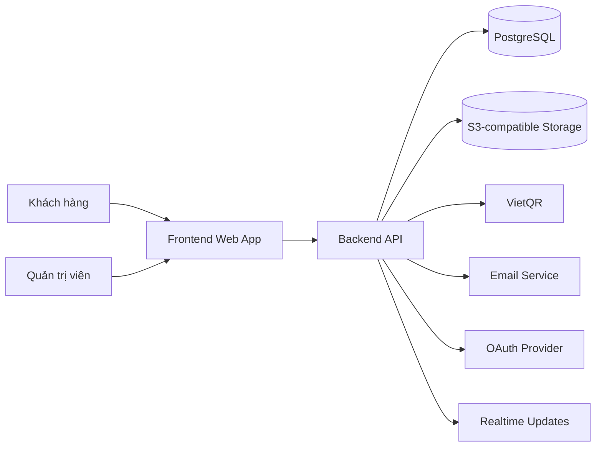
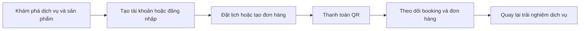
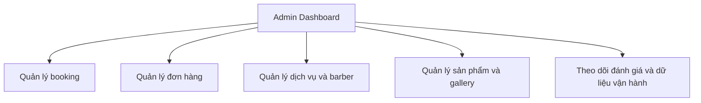

# Cutie Cuts

Cutie Cuts là một nền tảng web full-stack cho salon/barbershop, kết hợp website giới thiệu dịch vụ, đặt lịch, bán sản phẩm, thanh toán QR và khu vực quản trị vận hành trong cùng một hệ sinh thái.

Mục tiêu của dự án là đưa một website salon vượt khỏi vai trò landing page đơn thuần để trở thành một sản phẩm có thể hỗ trợ cả trải nghiệm khách hàng lẫn các nhu cầu vận hành phía sau.

## Tổng quan sản phẩm

Ở góc nhìn người dùng, Cutie Cuts hoạt động như một website nơi khách có thể khám phá dịch vụ, xem barber, theo dõi hình ảnh thực tế, tạo tài khoản, đặt lịch và mua sản phẩm chăm sóc tóc. Với người quản trị, hệ thống cung cấp không gian để quản lý dịch vụ, barber, sản phẩm, đơn hàng, booking, hình ảnh và nội dung đánh giá.

Ngoài các màn hình đang hiện diện trên frontend, backend hiện còn hỗ trợ thêm một số capability vận hành như hồ sơ người dùng nâng cao, lưu địa chỉ, thông báo, tổng hợp dữ liệu cá nhân, thanh toán và media flow ở mức API. Vì vậy phạm vi kỹ thuật của hệ thống đang rộng hơn phần giao diện người dùng đang mở ra công khai.

## Bức tranh tổng thể

## Nhóm chức năng chính

- Website public để giới thiệu thương hiệu, dịch vụ, gallery và sản phẩm.
- Khu vực người dùng cho đăng ký, đăng nhập, cập nhật hồ sơ, theo dõi booking và lịch sử mua hàng.
- Luồng booking theo dịch vụ, barber, ngày và khung giờ.
- Luồng commerce cơ bản với giỏ hàng, checkout và quản lý đơn hàng.
- Thanh toán QR cho đơn hàng, kèm cơ chế cập nhật trạng thái thanh toán.
- Khu vực admin để theo dõi số liệu và quản trị dữ liệu vận hành.
- Hỗ trợ upload và quản lý media phục vụ avatar, gallery và hình ảnh nghiệp vụ.

## Công nghệ sử dụng

| Lớp | Công nghệ |
| --- | --- |
| Frontend | React 18, TypeScript, Vite |
| UI | Tailwind CSS, Radix UI, shadcn/ui, Framer Motion |
| State & data | TanStack Query, React Context, React Hook Form, Zod |
| Routing & i18n | React Router, i18next |
| Backend | Java 17, Spring Boot 3 |
| Bảo mật | Spring Security, JWT, OAuth |
| Database | PostgreSQL |
| Media storage | S3-compatible storage / MinIO |
| Thanh toán | VietQR |
| Realtime & async | WebSocket, scheduler/background jobs |
| Tài liệu API | OpenAPI / Swagger |
| Kiểm thử | JUnit, Spring Boot Test, Vitest, Playwright |

## Frontend

Frontend được xây dựng bằng React 18, TypeScript và Vite theo hướng SPA, gộp website public, khu vực người dùng và admin panel trong cùng một ứng dụng. Phần giao diện sử dụng Tailwind CSS kết hợp Radix UI và shadcn/ui để dựng các thành phần tương tác, đồng thời có Framer Motion cho chuyển động và Recharts cho dashboard trực quan.

Ở lớp trải nghiệm ứng dụng, frontend dùng React Router cho điều hướng, TanStack Query cho gọi và đồng bộ dữ liệu từ API, React Hook Form cùng Zod cho form và validation, i18next cho đa ngôn ngữ, và Google OAuth cho đăng nhập liên kết. Hiện giao diện đã bao phủ các luồng chính như khám phá dịch vụ, booking, shop, checkout, hồ sơ cá nhân, lịch sử đơn hàng và khu vực quản trị.

## Backend

Backend được xây dựng bằng Java 17 và Spring Boot 3, đóng vai trò API trung tâm cho toàn bộ nghiệp vụ của hệ thống. Lớp này xử lý authentication, phân quyền, booking, order, review, gallery, quản lý người dùng, thanh toán QR và các tác vụ quản trị dành cho admin.

Về kỹ thuật, backend sử dụng Spring Security và JWT cho bảo mật, Spring Data JPA cho truy cập dữ liệu PostgreSQL, WebSocket cho cập nhật trạng thái gần realtime, OpenAPI/Swagger cho tài liệu API, cùng các tích hợp ngoài như OAuth, email service và S3-compatible storage. Ngoài các tính năng đã được frontend sử dụng trực tiếp, backend còn hỗ trợ thêm các capability ở mức API như address book, notifications, payment tracking và các luồng media/upload phục vụ mở rộng sản phẩm.

## Luồng trải nghiệm chính

## Mô hình vận hành

## Góc nhìn kiến trúc

Hệ thống được tổ chức theo mô hình frontend SPA tách biệt với backend API. Frontend đảm nhiệm trải nghiệm public, khu vực người dùng và admin panel; backend chịu trách nhiệm cho nghiệp vụ booking, order, authentication, payment, review, media và quản trị. Bên dưới là cơ sở dữ liệu quan hệ cho dữ liệu nghiệp vụ, object storage cho tệp hình ảnh và các tích hợp ngoài cho email, OAuth và QR payment.

## Phù hợp cho bài toán nào

Cutie Cuts phù hợp làm nền tảng cho salon, barbershop hoặc các mô hình dịch vụ tương tự cần kết hợp:

- giới thiệu thương hiệu và dịch vụ,
- đặt lịch có trạng thái,
- bán sản phẩm đi kèm dịch vụ,
- thanh toán nội địa bằng QR,
- và khu vực quản trị tập trung cho vận hành hằng ngày.
