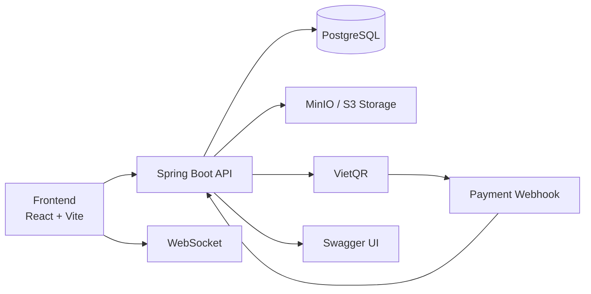

# Cutie Cuts

<p align="center">
  Full-stack salon platform for booking, commerce, VietQR payments, media management, and admin operations.
</p>

<p align="center">
  
  
  
  
  
</p>

## Tổng Quan

Cutie Cuts là hệ thống web salon gồm:

- Website khách hàng để khám phá dịch vụ, barber, gallery và sản phẩm.
- Khu vực người dùng để đặt lịch, theo dõi booking, đơn hàng và hồ sơ cá nhân.
- Trang quản trị để vận hành booking, catalog, đơn hàng, review và dashboard.
- Backend API phục vụ authentication, media upload, VietQR payment, webhook và realtime status updates.

Repo này phù hợp cho các bài toán:

- Booking dịch vụ có ràng buộc lịch, trạng thái và quy tắc hủy.
- E-commerce cho salon hoặc business nhỏ.
- QR payment theo flow nội địa Việt Nam.
- Hệ thống admin tách riêng với public storefront.

## Điểm Nổi Bật

| Nhóm | Những gì đang có |
| --- | --- |
| Customer experience | Đăng ký, đăng nhập, Google OAuth, xem dịch vụ, xem barber, gallery, mua sản phẩm, checkout |
| Booking | Tạo booking theo service, barber, ngày và giờ; xem lịch sử booking; hủy booking theo policy |
| Commerce | Shop, giỏ hàng, đơn hàng, theo dõi trạng thái thanh toán và lịch sử mua hàng |
| Payments | Tạo payment bằng VietQR, webhook cập nhật trạng thái, WebSocket phục vụ realtime flow |
| Content | Gallery, ảnh barber, avatar người dùng, upload qua MinIO/S3-compatible storage |
| Admin | Dashboard doanh thu và booking, quản lý users, services, barbers, products, orders, gallery, reviews |
| Platform | Swagger UI, JWT auth, email OTP cho verify/reset password, pagination/filtering ở nhiều màn quản trị |

## Luồng Sản Phẩm

1. Khách tạo tài khoản hoặc đăng nhập qua Google.
2. Người dùng duyệt dịch vụ, barber và gallery.
3. Người dùng đặt lịch hoặc thêm sản phẩm vào giỏ.
4. Hệ thống tạo order, sinh mã thanh toán VietQR và theo dõi trạng thái.
5. Admin quản lý booking, đơn hàng, catalog và xem số liệu dashboard.

## Kiến Trúc



### Thành phần chính

- `frontend/`
  Website public, trang người dùng và admin panel trong cùng một React app.
- `backend/cutie-cuts-app/`
  Spring Boot API cho auth, booking, shop, payment, upload, notifications và admin data.
- `backend/docker-compose.yml`
  Local stack cho backend, PostgreSQL và MinIO.
- Root docs
  Tài liệu vận hành riêng cho QR payment, API testing và troubleshooting.

## Giao Diện Và Route Chính

### Public

- `/`
- `/services`
- `/shop`
- `/gallery`
- `/about`
- `/contact`
- `/auth`

### Yêu cầu đăng nhập

- `/booking`
- `/checkout`
- `/profile`
- `/my-bookings`
- `/my-orders`

### Admin

- `/admin`
- `/admin/users`
- `/admin/bookings`
- `/admin/services`
- `/admin/barbers`
- `/admin/products`
- `/admin/orders`
- `/admin/gallery`
- `/admin/reviews`
- `/admin/settings`

## API Và Nghiệp Vụ Chính

Các module backend đáng chú ý:

- `AuthController`: register, login, verify email OTP, forgot/reset password, OAuth.
- `BookingController`: booking CRUD theo user/admin, filter trang quản trị, hủy booking theo policy.
- `OrderController`: order lifecycle cho shop.
- `PaymentController` và `PaymentWebhookController`: tạo payment, tra cứu payment, nhận cập nhật từ webhook.
- `ProductController`, `SalonServiceController`, `BarberController`, `GalleryController`, `ReviewController`: quản lý dữ liệu nghiệp vụ chính.
- `PresignController`, `UserAvatarController`: upload flow cho media.
- `AdminDashboardController`: dữ liệu dashboard vận hành.

Swagger UI là điểm vào tốt nhất để xem contract API và test request thực tế.

## Tech Stack

| Layer | Công nghệ |
| --- | --- |
| Frontend | React 18, TypeScript, Vite |
| UI | Tailwind CSS, Radix UI, shadcn/ui, Framer Motion |
| Data fetching | TanStack Query |
| Forms | React Hook Form, Zod |
| i18n | i18next |
| Backend | Java 17, Spring Boot 3.2 |
| Security | Spring Security, JWT, Google OAuth |
| Database | PostgreSQL 16 |
| Storage | MinIO, AWS S3 SDK |
| Realtime | Spring WebSocket |
| API docs | springdoc-openapi, Swagger UI |
| Email | Resend, SMTP |
| Testing | JUnit, Spring Boot Test, Vitest, Playwright |
| DevOps | Docker, Docker Compose, Nginx |

## Cấu Trúc Thư Mục

```text
main-app/
├── backend/
│   ├── init.sql
│   ├── pg_hba.conf
│   └── cutie-cuts-app/
│       ├── src/main/java/.../
│       │   ├── config/
│       │   ├── controller/
│       │   ├── dto/
│       │   ├── entity/
│       │   ├── repository/
│       │   ├── security/
│       │   └── service/
│       ├── src/main/resources/
│       ├── Dockerfile
│       └── pom.xml
├── frontend/
│   ├── public/
│   ├── src/
│   │   ├── components/
│   │   ├── context/
│   │   ├── hooks/
│   │   ├── i18n/
│   │   ├── lib/
│   │   ├── pages/
│   │   └── services/
│   ├── Dockerfile
│   ├── nginx.conf
│   └── package.json
├── HOW_TO_TEST_QR_PAYMENT.md
├── HOW_TO_UPDATE_PRODUCT_PRICES.md
├── PAYMENT_API_TESTING_GUIDE.md
├── PAYMENT_VIETQR_GUIDE.md
└── TROUBLESHOOTING_QR_NULL.md
```

## Chạy Nhanh

### Yêu cầu

- Java 17+
- Maven 3.9+
- Node.js 20+
- Docker Desktop

### 1. Khởi động backend stack

```bash
cd backend/cutie-cuts-app
docker compose up -d --build
```

Stack local sẽ mở:

- Backend API: `http://localhost:8081`
- PostgreSQL: `localhost:5433`
- MinIO API: `http://localhost:9000`
- MinIO Console: `http://localhost:9003`

### 2. Chạy frontend

```bash
cd frontend
npm install
npm run dev
```

Frontend mặc định chạy tại:

- `http://localhost:8080`

## Chạy Local Không Dùng Docker

### Backend

```bash
cd backend/cutie-cuts-app
./mvnw spring-boot:run
```

### Frontend

```bash
cd frontend
npm install
npm run dev
```

## Truy Cập Dịch Vụ

- Frontend: `http://localhost:8080`
- Backend API: `http://localhost:8081`
- Swagger UI: `http://localhost:8081/swagger-ui/index.html`
- MinIO Console: `http://localhost:9003`

## Biến Môi Trường Quan Trọng

### Backend

| Biến | Mục đích |
| --- | --- |
| `SERVER_PORT` | Port cho Spring Boot |
| `JWT_SECRET` | Ký JWT |
| `GOOGLE_CLIENT_ID` | Google OAuth |
| `PAYMENT_WEBHOOK_SECRET` | Xác thực webhook payment |
| `VIETQR_BANK_ID` | Cấu hình ngân hàng VietQR |
| `VIETQR_ACCOUNT_NO` | Số tài khoản nhận tiền |
| `VIETQR_ACCOUNT_NAME` | Tên tài khoản nhận tiền |
| `SPRING_DATASOURCE_URL` | Kết nối PostgreSQL |
| `SPRING_DATASOURCE_USERNAME` | User database |
| `SPRING_DATASOURCE_PASSWORD` | Password database |
| `S3_ENDPOINT` | Endpoint MinIO/S3 |
| `S3_PUBLIC_URL` | Public URL cho media |
| `S3_ACCESS_KEY` | Access key storage |
| `S3_SECRET_KEY` | Secret key storage |
| `S3_BUCKET_AVATARS` | Bucket avatar |
| `S3_BUCKET_GALLERY` | Bucket gallery |
| `S3_BUCKET_BARBERS` | Bucket barber images |
| `APP_MAIL_PROVIDER` | `console`, `smtp`, hoặc provider khác |
| `RESEND_API_KEY` | API key cho Resend |
| `MAIL_FROM` | Sender email |
| `SMTP_HOST` | SMTP host |
| `SMTP_PORT` | SMTP port |
| `SMTP_USERNAME` | SMTP username |
| `SMTP_PASSWORD` | SMTP password |

### Frontend

| Biến | Mục đích |
| --- | --- |
| `VITE_API_BASE_URL` | Base URL cho backend API |
| `VITE_GOOGLE_CLIENT_ID` | Google OAuth client ID |

## Testing

### Backend

```bash
cd backend/cutie-cuts-app
./mvnw test
```

### Frontend

```bash
cd frontend
npm test
```

Repo hiện có cấu hình cho:

- Unit/integration testing phía Spring Boot
- Vitest cho frontend logic
- Playwright config cho UI testing

## Tài Liệu Bổ Sung

- [HOW_TO_TEST_QR_PAYMENT.md](HOW_TO_TEST_QR_PAYMENT.md)
- [PAYMENT_API_TESTING_GUIDE.md](PAYMENT_API_TESTING_GUIDE.md)
- [PAYMENT_VIETQR_GUIDE.md](PAYMENT_VIETQR_GUIDE.md)
- [TROUBLESHOOTING_QR_NULL.md](TROUBLESHOOTING_QR_NULL.md)
- [HOW_TO_UPDATE_PRODUCT_PRICES.md](HOW_TO_UPDATE_PRODUCT_PRICES.md)

## Ghi Chú Hiện Trạng

- Frontend đang gộp public site, customer area và admin panel trong cùng app React.
- Backend hỗ trợ JWT auth, OTP email flows, OAuth và Swagger.
- Payment flow đã có VietQR, webhook và WebSocket cho cập nhật trạng thái.
- Storage đang đi theo hướng S3-compatible nên có thể thay MinIO bằng dịch vụ object storage khác.

## Kết Luận

Cutie Cuts không chỉ là landing page cho salon. Đây là một codebase full-stack có đầy đủ booking, commerce, payment và admin operations, phù hợp để mở rộng thành sản phẩm vận hành thực tế hoặc dùng làm nền tảng cho các bài toán service business tương tự.
