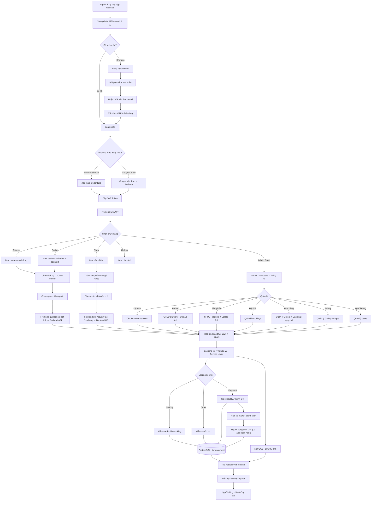
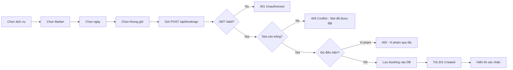
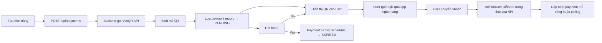
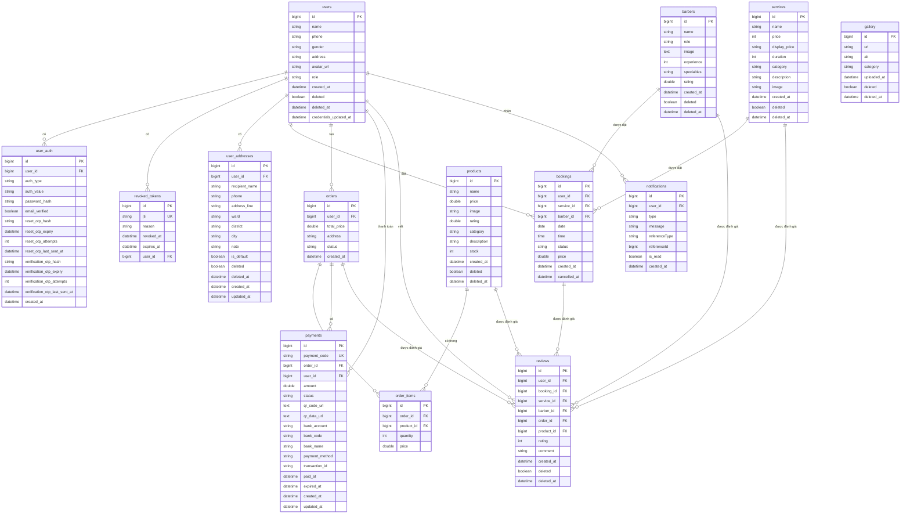
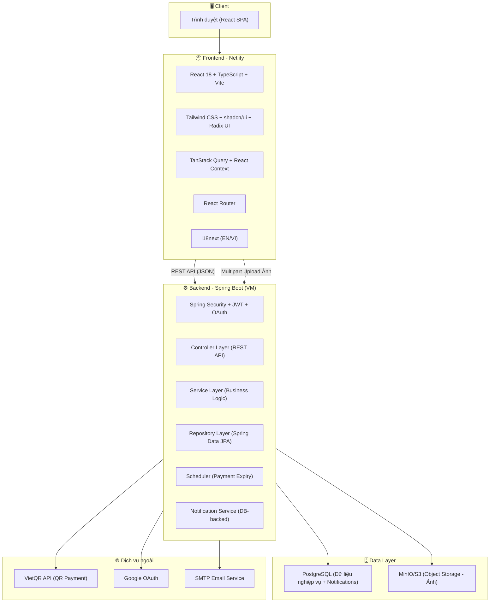

# PHẦN 4. QUYỂN BÁO CÁO

## DỰ ÁN: HỆ THỐNG ĐẶT LỊCH CẮT TÓC – CUTIE CUTS

---

### 4.1. BẢNG PHÂN CÔNG CÔNG VIỆC

| STT | Mã sinh viên | Họ tên | Công việc thực hiện | Nhánh Git | Ghi chú |
|-----|--------------|--------|---------------------|-----------|--------|
| 1 | [Cần bổ sung] | **Phạm Quốc Huy** (GitHub: quochuy103) | **Frontend Developer chính + Quản lý PR/Code Review** | `main`, `feat/deploy_netlify`, `feat/notification-ui`, `fix/corsblock`, `fix/vm-public-port-config`, `readme`, `feat/filter`, `feat/image-cropper-uploader`, `fix/admin-booking-status-localization`, `fix/review`, `feat/caching-db`, `fix/frontend-productpage` | 89 commits (gồm ~44 merge). Tích hợp API cho toàn bộ frontend, admin API integration, QR payment UI, profile page, i18n, quản lý toàn bộ PR |
| | | | - Thiết kế giao diện đăng nhập/đăng ký (AuthPage) | | |
| | | | - Xây dựng giao diện và tích hợp API trang đặt lịch (BookingPage) | | |
| | | | - Xây dựng giao diện và tích hợp API trang danh sách dịch vụ (ServicesPage) | | |
| | | | - Xây dựng giao diện và tích hợp API trang sản phẩm (ShopPage) | | |
| | | | - Xây dựng giao diện thanh toán QR (CheckoutPage) | | |
| | | | - Xây dựng trang quản lý đơn hàng cá nhân (MyOrdersPage) | | |
| | | | - Xây dựng trang quản lý đặt lịch cá nhân (MyBookingsPage) | | |
| | | | - Xây dựng trang hồ sơ cá nhân và upload ảnh đại diện (ProfilePage) | | |
| | | | - Xây dựng component ProtectedRoute và AdminRoute | | |
| | | | - Tích hợp API thực cho Admin Dashboard (thay thế mock data) | | |
| | | | - Xây dựng trang Admin Barbers (thêm/sửa/xóa barber) | | |
| | | | - Xây dựng trang Admin Gallery (quản lý hình ảnh) | | |
| | | | - Xây dựng trang Admin Orders (quản lý đơn hàng) | | |
| | | | - Thiết kế Navbar và điều hướng chính | | |
| | | | - Duy trì đa ngôn ngữ i18n (en.json, vi.json) | | |
| | | | - Quản lý merge và review code cho toàn bộ PR | | |
| | | | - Sửa lỗi CORS, cấu hình deploy Netlify | | |
| | | | - Tích hợp image cropper/uploader cho barber | | |
| | | | - Fix VietQR payment sync và format tiền tệ VND | | |
| 2 | [Cần bổ sung] | **Đức Anh** (GitHub: ducanhudu) | **Backend Developer chính + DevOps** | `f/addBarberAPI`, `f/addSalonServiceAPI`, `f/addSwagger`, `f/barber-find-by-id`, `f/notification-service`, `f/prevent-double-booking`, `f/productAPI`, `f/rbac-all-api`, `f/testNewRouteForAPI`, `feat/forgot-password-reset-flow`, `feat/gmail-smtp-otp-email`, `feat/user-addresses`, `fix/api-prefix-security-consistency`, `fix/backend-build-and-payments-schema`, `fix/backend-flow-hardening-phase-2`, `fix/backend-hardening-bookings-orders`, `fix/backend-payment-image-pagination`, `fix/backend-validation-error-handling`, `fix/barber-image-cleanup`, `fix/barber-image-upload-bug`, `fix/direct-minio-image-upload`, `fix/direct-object-storage-uploads`, `fix/otp-email-cleanup`, `fix/remaining-api-filters`, `fix/reviews-order-id-column`, `fix/s3-storage-bug` | 58 commits (gồm ~14 merge). Khởi tạo toàn bộ backend nền tảng, Payment/VietQR, Booking logic, OAuth |
| | | | - Khởi tạo toàn bộ backend nền tảng (entities, repositories, controllers, security, JWT auth) | | |
| | | | - Thiết kế cấu trúc thư mục monorepo (frontend + backend) | | |
| | | | - Xây dựng hệ thống xác thực JWT và Spring Security | | |
| | | | - Xây dựng Google OAuth login (GoogleTokenVerifier, OAuthService) | | |
| | | | - Xây dựng chức năng đăng xuất và JWT blacklist | | |
| | | | - Xây dựng component SocialLoginButtons (frontend Google login) | | |
| | | | - Xây dựng toàn bộ Payment System (PaymentController, PaymentService, VietQRService, Payment Entity, PaymentTransaction Entity) | | |
| | | | - Xây dựng Payment Expiry Scheduler (tự động expire payment) | | |
| | | | - Xây dựng cơ chế cập nhật trạng thái thanh toán và đơn hàng | | |
| | | | - Xây dựng quy tắc booking (hủy tối đa 3 lần/ngày, hủy trước 30p) | | |
| | | | - Xây dựng chức năng hủy đặt lịch và đơn hàng | | |
| | | | - Xây dựng chức năng chặn spam đặt lịch | | |
| | | | - Chuẩn hóa trạng thái đơn hàng (DomainStatusRules) | | |
| | | | - Xây dựng User Profile backend (UserController, UserProfileService) | | |
| | | | - Xây dựng Review API (đánh giá đơn hàng/sản phẩm) | | |
| | | | - Thiết lập Dockerfile cho backend và frontend | | |
| | | | - Thiết lập docker-compose.yml cho PostgreSQL | | |
| | | | - Quản lý biến môi trường (.env, .env.example) | | |
| | | | - Cấu hình nginx.conf | | |
| | | | - Viết Unit Test cho BookingService, AuthService, OrderController | | |
| | | | - Viết booking-policy.ts và test cho frontend | | |
| | | | - Viết README.md cho dự án | | |
| 3 | [Cần bổ sung] | **Hawkeon** (GitHub: Hawkeon) | **Backend Developer + Security/Infrastructure** | `feat/backend-image-upload-proxy`, `fix/vm-public-port-config`, `feat/repositive` | 47 commits (gồm ~6 merge). Xây dựng toàn bộ CRUD API, Security (RBAC, Rate Limiting), MinIO/S3 Upload, OTP/Forgot Password, Database Schema |
| | | | - Xây dựng toàn bộ Barber CRUD API (Controller, Service, DTOs, Repository) | | |
| | | | - Xây dựng toàn bộ SalonService CRUD API | | |
| | | | - Xây dựng toàn bộ Product CRUD API | | |
| | | | - Xây dựng toàn bộ Notification System (Controller, Service, Entity) | | |
| | | | - Xây dựng toàn bộ User Addresses System | | |
| | | | - Xây dựng hệ thống RBAC (phân quyền cho toàn bộ API endpoints) | | |
| | | | - Cấu hình Spring Security (permit public, admin bypass, JWT filter) | | |
| | | | - Xây dựng Rate Limiting (InMemoryRateLimiter + RateLimitFilter) | | |
| | | | - Xây dựng hệ thống upload ảnh qua Backend proxy (FE → BE → MinIO) (UserAvatarController, S3StorageService, ImageStorageService) | | |
| | | | - Xây dựng Image Storage Service (quản lý ảnh barber/product/gallery) | | |
| | | | - Xây dựng chức năng dọn dẹp ảnh khi cập nhật/xóa barber | | |
| | | | - Cấu hình MinIO CORS lock down | | |
| | | | - Xây dựng chức năng chống double-booking (409 Conflict + SlotAlreadyBookedException) | | |
| | | | - Xây dựng toàn bộ flow quên mật khẩu (ForgotPassword, ResetPassword, VerifyEmailOtp, ResendVerificationOtp, ConsoleEmailService) | | |
| | | | - Thiết kế và nâng cấp Database Schema (soft deletes, indexes, FK constraints) | | |
| | | | - Xây dựng API filtering và pagination cho 9 endpoints | | |
| | | | - Cấu hình Swagger/OpenAPI (SpringDoc) | | |
| | | | - Cấu hình Swagger JWT auth | | |
| | | | - Thiết lập docker-compose.yml cho PostgreSQL + pg_hba.conf + init.sql | | |
| | | | - Xây dựng Data Initializer (seed data ban đầu) | | |
| | | | - Sửa lỗi build backend và validation errors | | |
| | | | - Bảo mật payment access (ownership checks) | | |
| | | | - Viết Unit Test cho S3StorageService, OrderController, UserAddressService | | |
| | | | - Backend image upload proxy (feat/backend-image-upload-proxy) | | |

> **Ghi chú quan trọng:**
> - Mã sinh viên của các thành viên cần được bổ sung thủ công.
> - Các nhánh git được liệt kê là các nhánh thực tế trong repository.
> - Bot `gpt-engineer-app[bot]` (24 commits) không phải thành viên nhóm – chỉ tạo scaffold UI ban đầu.
> - `Lovable` (1 commit) là template khởi tạo ban đầu – không phải thành viên nhóm.

---

### 4.2. BIỂU ĐỒ MÔ TẢ LUỒNG HOẠT ĐỘNG CỦA HỆ THỐNG

#### 4.2.1. Mô tả bằng lời

Hệ thống Cutie Cuts hoạt động theo mô hình client-server, trong đó:

1. **Người dùng truy cập hệ thống**: Khách hàng truy cập website qua trình duyệt. Hệ thống hiển thị giao diện chính với các thông tin về dịch vụ, barber, sản phẩm và gallery.

2. **Đăng ký/Đăng nhập**: Người dùng có thể đăng ký tài khoản mới (email + mật khẩu, có xác thực OTP qua email) hoặc đăng nhập bằng Google OAuth. Sau khi đăng nhập, JWT token được cấp và lưu ở client.

3. **Khám phá dịch vụ và sản phẩm**: Người dùng có thể xem danh sách dịch vụ cắt tóc, danh sách barber kèm đánh giá, danh sách sản phẩm chăm sóc tóc, và gallery hình ảnh.

4. **Đặt lịch (Booking)**: Người dùng chọn dịch vụ → chọn barber → chọn ngày → chọn khung giờ → xác nhận đặt lịch. Backend kiểm tra xung đột lịch (double-booking), áp dụng quy tắc nghiệp vụ (hủy tối đa 3 lần/ngày, đặt trước tối thiểu 30 phút).

5. **Mua sắm (Shop)**: Người dùng thêm sản phẩm vào giỏ hàng → checkout → nhập địa chỉ giao hàng → chọn thanh toán VietQR → hệ thống sinh mã QR.

6. **Thanh toán VietQR**: Mã QR được sinh từ VietQR API, hiển thị cho người dùng quét qua app ngân hàng để chuyển khoản. Payment tự động expire sau thời gian quy định.

7. **Theo dõi trạng thái**: Người dùng có thể xem lịch sử đặt lịch, theo dõi trạng thái đơn hàng, xem và viết đánh giá.

8. **Quản trị (Admin)**: Admin có thể quản lý toàn bộ dữ liệu hệ thống: dịch vụ, barber, sản phẩm, đơn hàng, đặt lịch, gallery, người dùng, và theo dõi thống kê qua dashboard.

9. **Backend xử lý**: Backend Spring Boot xử lý tất cả request từ frontend, xác thực qua JWT filter, phân quyền qua RBAC, kiểm tra rate limit, validate dữ liệu đầu vào, xử lý nghiệp vụ qua Service layer, và tương tác với PostgreSQL qua JPA Repository.

10. **Database và Storage**: PostgreSQL lưu trữ toàn bộ dữ liệu nghiệp vụ. MinIO/S3 lưu trữ file hình ảnh (avatar, barber, gallery). Hệ thống thông báo (notification) lưu trong database và được frontend poll định kỳ để cập nhật trạng thái.

#### 4.2.2. Biểu đồ luồng tổng quát (Mermaid Flowchart)



#### 4.2.3. Biểu đồ luồng đặt lịch chi tiết (Booking Flow)



#### 4.2.4. Biểu đồ luồng thanh toán (Payment Flow)



---

### 4.3. SƠ ĐỒ VÀ MÔ TẢ THIẾT KẾ CƠ SỞ DỮ LIỆU

#### 4.3.1. Công nghệ lưu trữ

| Thành phần | Công nghệ | Mục đích |
|-----------|-----------|----------|
| Database chính | PostgreSQL | Lưu toàn bộ dữ liệu nghiệp vụ |
| Object Storage | MinIO (S3-compatible) | Lưu file hình ảnh (avatar, barber, gallery, product) |
| ORM | Spring Data JPA / Hibernate | Mapping Java Entity ↔ Database Table |

#### 4.3.2. Danh sách bảng dữ liệu

| # | Tên bảng | Mô tả | Số cột chính |
|---|---------|-------|-------------|
| 1 | `users` | Thông tin người dùng | 11 |
| 2 | `user_auth` | Phương thức xác thực (email, Google OAuth) | 15 |
| 3 | `revoked_tokens` | JWT tokens đã bị thu hồi | 6 |
| 4 | `user_addresses` | Địa chỉ giao hàng của người dùng | 13 |
| 5 | `barbers` | Thông tin thợ cắt tóc | 10 |
| 6 | `services` | Dịch vụ cắt tóc | 10 |
| 7 | `products` | Sản phẩm chăm sóc tóc | 10 |
| 8 | `bookings` | Lịch đặt cắt tóc | 10 |
| 9 | `orders` | Đơn hàng mua sản phẩm | 6 |
| 10 | `order_items` | Chi tiết sản phẩm trong đơn hàng | 5 |
| 11 | `payments` | Thanh toán VietQR | 16 |
| 12 | `payment_transactions` | Lịch sử giao dịch thanh toán | - |
| 13 | `reviews` | Đánh giá dịch vụ/sản phẩm/barber | 12 |
| 14 | `review_target_ratings` | Điểm đánh giá tổng hợp theo mục tiêu | - |
| 15 | `gallery` | Hình ảnh gallery | 7 |
| 16 | `notifications` | Thông báo người dùng | 8 |
| 17 | `api_cache_entries` | Cache dữ liệu API (Admin Dashboard) | - |

#### 4.3.3. Sơ đồ quan hệ cơ sở dữ liệu (Entity Relationship Diagram)



#### 4.3.4. Mô tả chi tiết các bảng chính

**Bảng `users`**: Lưu thông tin cơ bản của người dùng. Trường `role` xác định phân quyền: `USER` (khách hàng), `ADMIN` (quản trị viên), `BARBER` (thợ cắt tóc). Trường `deleted` dùng cho soft delete. Một user có thể có nhiều `auth_methods` (email password, Google OAuth).

**Bảng `user_auth`**: Lưu phương thức xác thực của người dùng. Hỗ trợ `auth_type`: `EMAIL`, `GOOGLE`. Lưu `password_hash` (bcrypt) cho đăng nhập email. Các trường OTP hỗ trợ flow quên mật khẩu và xác thực email.

**Bảng `bookings`**: Lưu thông tin đặt lịch. Liên kết tới `users` (người đặt), `services` (dịch vụ), `barbers` (thợ cắt). `status` có các giá trị: `pending`, `confirmed`, `completed`, `cancelled`. Ràng buộc: mỗi barber chỉ có 1 booking tại 1 thời điểm (date + time).

**Bảng `orders`**: Lưu đơn hàng mua sản phẩm. Liên kết tới `users`. `status`: `pending`, `confirmed`, `processing`, `shipping`, `delivered`, `cancelled`. `order_items` lưu chi tiết từng sản phẩm trong đơn.

**Bảng `payments`**: Lưu thông tin thanh toán VietQR. `payment_code` là mã duy nhất. `qr_code_url` và `qr_data_url` lưu mã QR từ VietQR API. `status`: `PENDING`, `PAID`, `EXPIRED`, `CANCELLED`. `expired_at` quy định thời gian hết hạn thanh toán.

**Bảng `reviews`**: Lưu đánh giá của người dùng. Có thể đánh giá cho booking (dịch vụ + barber) hoặc order (sản phẩm). Ràng buộc UNIQUE đảm bảo mỗi booking chỉ được đánh giá 1 lần, mỗi cặp (order, product) chỉ 1 review.

**Bảng `notifications`**: Lưu thông báo gửi đến người dùng. `type`: `BOOKING_CONFIRMED`, `BOOKING_CANCELLED`, `ORDER_STATUS`, `PAYMENT_RECEIVED`, v.v. `is_read` đánh dấu đã đọc.

**Bảng `revoked_tokens`**: Lưu các JWT token đã bị thu hồi (logout, đổi mật khẩu). Dùng `jti` làm unique key. Tự động dọn dẹp token hết hạn.

---

### 4.4. MÔ TẢ CÁC CHỨC NĂNG TRONG HỆ THỐNG

#### 4.4.1. Nhóm chức năng người dùng (User-facing)

##### 4.4.1.1. Trang chủ (Home Page)

**Mô tả**: Trang landing page giới thiệu thương hiệu Cutie Cuts, hiển thị hero section với slogan và CTA, danh sách dịch vụ nổi bật, barber tiêu biểu, sản phẩm bán chạy, và gallery hình ảnh thực tế. Có navigation bar cho phép điều hướng đến các trang chức năng.

**File chính**:
- [src/pages/Index.tsx](frontend/src/pages/Index.tsx)
- [src/components/Navbar.tsx](frontend/src/components/Navbar.tsx)
- [src/components/Footer.tsx](frontend/src/components/Footer.tsx)

**Ảnh chụp thực tế**: *[Chèn ảnh chụp màn hình Trang chủ tại đây]*

---

##### 4.4.1.2. Đăng ký / Đăng nhập (Authentication)

**Mô tả**: Hệ thống hỗ trợ 2 phương thức:
- **Đăng ký/Đăng nhập bằng Email**: Người dùng nhập email + mật khẩu. Khi đăng ký, hệ thống gửi OTP xác thực email (6 chữ số). JWT token được cấp sau khi đăng nhập thành công.
- **Đăng nhập bằng Google OAuth**: Sử dụng Google Identity Services, người dùng chọn tài khoản Google để đăng nhập nhanh.
- **Quên mật khẩu**: Nhập email → nhận OTP → đặt mật khẩu mới.

**API endpoints**:
- `POST /api/auth/register` — Đăng ký
- `POST /api/auth/login` — Đăng nhập
- `POST /api/auth/oauth/google` — Google OAuth login
- `POST /api/auth/forgot-password` — Gửi OTP quên mật khẩu
- `POST /api/auth/reset-password` — Đặt lại mật khẩu
- `POST /api/auth/verify-email-otp` — Xác thực email OTP
- `POST /api/auth/resend-verification-otp` — Gửi lại OTP

**File chính**:
- [src/pages/AuthPage.tsx](frontend/src/pages/AuthPage.tsx)
- [src/components/SocialLoginButtons.tsx](frontend/src/components/SocialLoginButtons.tsx)
- [src/components/ProtectedRoute.tsx](frontend/src/components/ProtectedRoute.tsx)
- [src/context/AuthContext.tsx](frontend/src/context/AuthContext.tsx)
- `AuthController.java`, `AuthService.java`, `OAuthService.java`, `TokenService.java`

**Ảnh chụp thực tế**: *[Chèn ảnh chụp màn hình Trang Đăng nhập và Đăng ký tại đây]*

---

##### 4.4.1.3. Dịch vụ (Services Page)

**Mô tả**: Hiển thị danh sách các dịch vụ cắt tóc theo danh mục (cắt, nhuộm, uốn, gội...). Mỗi dịch vụ hiển thị: tên, giá, thời lượng, mô tả, hình ảnh minh họa. Người dùng có thể lọc theo danh mục và chọn dịch vụ để đặt lịch.

**API endpoint**: `GET /api/services?category=&page=&size=`

**File chính**:
- [src/pages/ServicesPage.tsx](frontend/src/pages/ServicesPage.tsx)
- [src/components/ServiceCard.tsx](frontend/src/components/ServiceCard.tsx)
- `SalonServiceController.java`, `SalonServiceService.java`

**Ảnh chụp thực tế**: *[Chèn ảnh chụp màn hình Trang Dịch vụ tại đây]*

---

##### 4.4.1.4. Đặt lịch (Booking Page)

**Mô tả**: Luồng đặt lịch gồm các bước: chọn dịch vụ → chọn barber → chọn ngày (trên calendar) → chọn khung giờ (hiển thị các slot còn trống) → xác nhận đặt lịch. Hệ thống kiểm tra:
- Slot không bị trùng (double-booking prevention)
- Đặt lịch trước tối thiểu 30 phút
- Không hủy quá 3 lần/ngày

**API endpoint**: `POST /api/bookings`, `GET /api/bookings/my`, `PATCH /api/bookings/{id}/cancel`

**File chính**:
- [src/pages/BookingPage.tsx](frontend/src/pages/BookingPage.tsx)
- [src/lib/booking-policy.ts](frontend/src/lib/booking-policy.ts)
- [src/lib/booking-policy.test.ts](frontend/src/lib/booking-policy.test.ts)
- [src/pages/MyBookingsPage.tsx](frontend/src/pages/MyBookingsPage.tsx)
- `BookingController.java`, `BookingService.java`

**Ảnh chụp thực tế**: *[Chèn ảnh chụp màn hình Trang Đặt lịch tại đây]*

---

##### 4.4.1.5. Shop (Trang sản phẩm)

**Mô tả**: Hiển thị danh sách sản phẩm chăm sóc tóc (sáp, gel, dầu gội, phụ kiện...) theo danh mục. Mỗi sản phẩm hiển thị: tên, giá, hình ảnh, đánh giá sao, tồn kho. Người dùng có thể: lọc theo danh mục, tìm kiếm, xem chi tiết sản phẩm, thêm vào giỏ hàng.

**API endpoint**: `GET /api/products?category=&page=&size=`, `GET /api/products/{id}`

**File chính**:
- [src/pages/ShopPage.tsx](frontend/src/pages/ShopPage.tsx)
- [src/pages/ProductDetailPage.tsx](frontend/src/pages/ProductDetailPage.tsx)
- [src/components/ProductCard.tsx](frontend/src/components/ProductCard.tsx)
- [src/context/CartContext.tsx](frontend/src/context/CartContext.tsx)
- [src/components/CartSidebar.tsx](frontend/src/components/CartSidebar.tsx)
- `ProductController.java`, `ProductService.java`

**Ảnh chụp thực tế**: *[Chèn ảnh chụp màn hình Trang Shop tại đây]*

---

##### 4.4.1.6. Giỏ hàng & Thanh toán (Cart & Checkout)

**Mô tả**: Giỏ hàng lưu ở CartContext (client-side). Khi checkout:
1. Người dùng nhập/xác nhận địa chỉ giao hàng
2. Hệ thống tạo đơn hàng (POST /api/orders)
3. Chọn thanh toán VietQR → hệ thống gọi VietQR API → sinh QR code
4. QR code hiển thị kèm thông tin ngân hàng, số tài khoản, số tiền
5. Người dùng quét QR qua app ngân hàng
6. Người dùng thực hiện chuyển khoản qua app ngân hàng.

**API endpoints**:
- `POST /api/orders` — Tạo đơn hàng
- `GET /api/orders/my` — Xem đơn hàng của tôi
- `POST /api/payments` — Tạo payment + sinh QR
- `GET /api/payments/{id}` — Xem chi tiết payment

**File chính**:
- [src/pages/CheckoutPage.tsx](frontend/src/pages/CheckoutPage.tsx)
- [src/pages/MyOrdersPage.tsx](frontend/src/pages/MyOrdersPage.tsx)
- [src/components/CartSidebar.tsx](frontend/src/components/CartSidebar.tsx)
- `OrderController.java`, `PaymentController.java`
- `VietQRService.java`, `PaymentService.java`, `PaymentExpiryScheduler.java`

**Ảnh chụp thực tế**: *[Chèn ảnh chụp màn hình Trang Checkout và QR Payment tại đây]*

---

##### 4.4.1.7. Hồ sơ cá nhân (Profile Page)

**Mô tả**: Người dùng có thể xem và cập nhật thông tin cá nhân: tên, số điện thoại, giới tính, địa chỉ, avatar. Avatar được upload qua Backend proxy: Frontend gửi file ảnh lên Backend bằng multipart/form-data, Backend kiểm tra quyền và lưu ảnh vào MinIO thông qua mạng nội bộ.

**API endpoint**: `GET /api/user/profile`, `PUT /api/user/profile`, `POST /api/users/me/avatar`

**File chính**:
- [src/pages/ProfilePage.tsx](frontend/src/pages/ProfilePage.tsx)
- [src/components/ImageUploader.tsx](frontend/src/components/ImageUploader.tsx)
- [src/services/uploadService.ts](frontend/src/services/uploadService.ts)
- `UserController.java`, `UserProfileService.java`, `UserAvatarController.java`

**Ảnh chụp thực tế**: *[Chèn ảnh chụp màn hình Trang Hồ sơ cá nhân tại đây]*

---

##### 4.4.1.8. Gallery (Trang hình ảnh)

**Mô tả**: Hiển thị bộ sưu tập hình ảnh thực tế của salon, phân loại theo danh mục: kiểu tóc nam, kiểu tóc nữ, nhuộm, uốn, không gian salon...

**API endpoint**: `GET /api/gallery?category=&page=&size=`

**File chính**:
- [src/pages/GalleryPage.tsx](frontend/src/pages/GalleryPage.tsx)
- `GalleryController.java`, `GalleryImageService.java`

**Ảnh chụp thực tế**: *[Chèn ảnh chụp màn hình Trang Gallery tại đây]*

---

##### 4.4.1.9. Đánh giá (Reviews)

**Mô tả**: Người dùng có thể viết đánh giá kèm sao (1-5) cho: dịch vụ sau khi hoàn thành booking, sản phẩm sau khi nhận hàng. Hệ thống cũng hiển thị điểm đánh giá tổng hợp cho từng barber, dịch vụ, sản phẩm.

**API endpoint**: `POST /api/reviews`, `GET /api/reviews?targetType=&targetId=`

**File chính**:
- [src/components/ReviewCard.tsx](frontend/src/components/ReviewCard.tsx)
- [src/components/ReviewModal.tsx](frontend/src/components/ReviewModal.tsx)
- [src/components/BookingReviewModal.tsx](frontend/src/components/BookingReviewModal.tsx)
- [src/components/BarberReviewsModal.tsx](frontend/src/components/BarberReviewsModal.tsx)
- `ReviewController.java`, `ReviewService.java`

**Ảnh chụp thực tế**: *[Chèn ảnh chụp màn hình Trang Đánh giá tại đây]*

---

#### 4.4.2. Nhóm chức năng quản trị (Admin Panel)

##### 4.4.2.1. Admin Dashboard (Trang tổng quan)

**Mô tả**: Hiển thị các chỉ số thống kê: tổng số booking, tổng doanh thu, số đơn hàng, số khách hàng mới, booking theo ngày. Biểu đồ trực quan (Recharts) hiển thị doanh thu theo tháng, booking theo barber, sản phẩm bán chạy. Hỗ trợ cache dữ liệu để tối ưu hiệu năng.

**API endpoint**: `GET /api/admin/dashboard`

**File chính**:
- [src/pages/admin/AdminDashboard.tsx](frontend/src/pages/admin/AdminDashboard.tsx)
- [src/components/admin/StatsCard.tsx](frontend/src/components/admin/StatsCard.tsx)
- `AdminDashboardController.java`, `AdminDashboardService.java`

**Ảnh chụp thực tế**: *[Chèn ảnh chụp màn hình Admin Dashboard tại đây]*

---

##### 4.4.2.2. Quản lý Barber (Admin Barbers)

**Mô tả**: CRUD đầy đủ cho thợ cắt tóc: thêm mới (tên, vai trò, kinh nghiệm, chuyên môn, ảnh), sửa, xóa mềm. Upload ảnh barber qua Backend proxy (Frontend → Backend → MinIO). Hỗ trợ phân trang và tìm kiếm.

**API endpoint**: `GET/POST/PUT/DELETE /api/barbers`

**File chính**:
- [src/pages/admin/AdminBarbers.tsx](frontend/src/pages/admin/AdminBarbers.tsx)
- [src/components/ImageUploader.tsx](frontend/src/components/ImageUploader.tsx)

**Ảnh chụp thực tế**: *[Chèn ảnh chụp màn hình Admin Barbers tại đây]*

---

##### 4.4.2.3. Quản lý Dịch vụ (Admin Services)

**Mô tả**: CRUD cho dịch vụ cắt tóc: thêm mới (tên, giá, thời lượng, danh mục, mô tả, ảnh), sửa, xóa mềm.

**API endpoint**: `GET/POST/PUT/DELETE /api/services`

**File chính**: [src/pages/admin/AdminServices.tsx](frontend/src/pages/admin/AdminServices.tsx)

**Ảnh chụp thực tế**: *[Chèn ảnh chụp màn hình Admin Services tại đây]*

---

##### 4.4.2.4. Quản lý Sản phẩm (Admin Products)

**Mô tả**: CRUD cho sản phẩm: thêm mới (tên, giá, danh mục, mô tả, tồn kho, ảnh), sửa, xóa mềm.

**API endpoint**: `GET/POST/PUT/DELETE /api/products`

**File chính**: [src/pages/admin/AdminProducts.tsx](frontend/src/pages/admin/AdminProducts.tsx)

**Ảnh chụp thực tế**: *[Chèn ảnh chụp màn hình Admin Products tại đây]*

---

##### 4.4.2.5. Quản lý Đặt lịch (Admin Bookings)

**Mô tả**: Xem tất cả booking trong hệ thống. Có thể lọc theo trạng thái (pending, confirmed, completed, cancelled), theo ngày, theo barber. Cập nhật trạng thái booking.

**API endpoint**: `GET /api/bookings?status=&date=&barberId=`, `PATCH /api/bookings/{id}/status`

**File chính**: [src/pages/admin/AdminBookings.tsx](frontend/src/pages/admin/AdminBookings.tsx)

**Ảnh chụp thực tế**: *[Chèn ảnh chụp màn hình Admin Bookings tại đây]*

---

##### 4.4.2.6. Quản lý Đơn hàng (Admin Orders)

**Mô tả**: Xem tất cả đơn hàng. Cập nhật trạng thái đơn hàng (xác nhận, đang xử lý, đang giao, đã giao, hủy). Lọc theo trạng thái, ngày, khách hàng.

**API endpoint**: `GET /api/orders?status=&page=&size=`, `PATCH /api/orders/{id}/status`

**File chính**: [src/pages/admin/AdminOrders.tsx](frontend/src/pages/admin/AdminOrders.tsx)

**Ảnh chụp thực tế**: *[Chèn ảnh chụp màn hình Admin Orders tại đây]*

---

##### 4.4.2.7. Quản lý Gallery (Admin Gallery)

**Mô tả**: Upload và quản lý hình ảnh gallery. Upload qua Backend proxy (Frontend → Backend → MinIO). Phân loại ảnh theo danh mục (kiểu tóc, không gian...). Xóa ảnh.

**API endpoint**: `GET/POST/DELETE /api/gallery`

**File chính**: [src/pages/admin/AdminGallery.tsx](frontend/src/pages/admin/AdminGallery.tsx)

**Ảnh chụp thực tế**: *[Chèn ảnh chụp màn hình Admin Gallery tại đây]*

---

##### 4.4.2.8. Quản lý Người dùng (Admin Users)

**Mô tả**: Xem danh sách người dùng. Phân quyền (USER, ADMIN, BARBER). Xóa mềm người dùng.

**API endpoint**: `GET /api/users?role=&page=&size=`

**File chính**: [src/pages/admin/AdminUsers.tsx](frontend/src/pages/admin/AdminUsers.tsx)

**Ảnh chụp thực tế**: *[Chèn ảnh chụp màn hình Admin Users tại đây]*

---

##### 4.4.2.9. Quản lý Đánh giá (Admin Reviews)

**Mô tả**: Xem và quản lý tất cả đánh giá. Xóa đánh giá không phù hợp.

**API endpoint**: `GET /api/reviews`, `DELETE /api/reviews/{id}`

**File chính**: [src/pages/admin/AdminReviews.tsx](frontend/src/pages/admin/AdminReviews.tsx)

**Ảnh chụp thực tế**: *[Chèn ảnh chụp màn hình Admin Reviews tại đây]*

---

#### 4.4.3. Các chức năng kỹ thuật / hạ tầng

| Chức năng | Mô tả | Công nghệ |
|-----------|-------|-----------|
| **JWT Authentication** | Xác thực bằng JWT token. Token được ký bằng secret key, có thời hạn. Support refresh. | Spring Security + JWT (io.jsonwebtoken) |
| **RBAC (Role-Based Access Control)** | Phân quyền API theo role: public endpoints (đăng ký, đăng nhập, xem dịch vụ), USER endpoints (đặt lịch, mua hàng), ADMIN endpoints (quản lý). | Spring Security + JwtFilter |
| **Rate Limiting** | Giới hạn số request trong khoảng thời gian để chống spam/abuse. | InMemoryRateLimiter + RateLimitFilter (custom) |
| **OTP Email Verification** | Gửi OTP 6 số qua email cho xác thực đăng ký và quên mật khẩu. | ConsoleEmailService / SmtpEmailService |
| **Backend Proxy Image Upload** | Upload ảnh qua Backend: Frontend gửi file multipart/form-data lên Backend, Backend kiểm tra quyền rồi lưu vào MinIO qua mạng nội bộ. | ImageStorageService + S3StorageService |
| **Database-Backed Notifications** | Thông báo lưu trong DB, Frontend poll API định kỳ để hiển thị thông báo mới. Backend tạo notification khi trạng thái booking/order thay đổi. | Notification entity + NotificationService + Frontend polling |
| **Payment Expiry Scheduler** | Tự động chuyển payment PENDING thành EXPIRED sau thời gian quy định. | Spring Scheduling (@Scheduled) |
| **API Documentation** | Tài liệu API tự động qua Swagger UI. | SpringDoc OpenAPI |
| **Multi-language (i18n)** | Hỗ trợ tiếng Việt và tiếng Anh. | i18next (frontend) |
| **API Caching** | Cache dữ liệu Admin Dashboard để tối ưu hiệu năng. | ApiCacheEntry (JPA entity) |
| **Double-booking Prevention** | Kiểm tra và chặn đặt lịch trùng slot (cùng barber, cùng ngày, cùng giờ). | BookingService validation |

---

### 4.5. KIẾN TRÚC HỆ THỐNG



---

### 4.6. DANH SÁCH API CHÍNH

#### 4.6.1. Authentication APIs

| Method | Endpoint | Mô tả | Auth |
|--------|----------|-------|------|
| POST | `/api/auth/register` | Đăng ký tài khoản mới | Public |
| POST | `/api/auth/login` | Đăng nhập (email + password) | Public |
| POST | `/api/auth/oauth/google` | Đăng nhập Google OAuth | Public |
| POST | `/api/auth/forgot-password` | Gửi OTP quên mật khẩu | Public |
| POST | `/api/auth/reset-password` | Đặt lại mật khẩu | Public |
| POST | `/api/auth/verify-email-otp` | Xác thực email OTP | Public |
| POST | `/api/auth/resend-verification-otp` | Gửi lại OTP xác thực | Public |
| POST | `/api/auth/change-password` | Đổi mật khẩu | USER |
| POST | `/auth/logout` | Đăng xuất và thu hồi JWT | USER |

#### 4.6.2. Barber APIs

| Method | Endpoint | Mô tả | Auth |
|--------|----------|-------|------|
| GET | `/api/barbers` | Danh sách barber (phân trang, lọc) | Public |
| GET | `/api/barbers/{id}` | Chi tiết barber | Public |
| GET | `/api/barbers/exists/{id}` | Kiểm tra barber tồn tại | Public |
| POST | `/api/barbers` | Thêm barber mới | ADMIN |
| PUT | `/api/barbers/{id}` | Cập nhật barber | ADMIN |
| DELETE | `/api/barbers/{id}` | Xóa barber (soft delete) | ADMIN |

#### 4.6.3. Service APIs

| Method | Endpoint | Mô tả | Auth |
|--------|----------|-------|------|
| GET | `/api/services` | Danh sách dịch vụ (phân trang, lọc) | Public |
| GET | `/api/services/{id}` | Chi tiết dịch vụ | Public |
| POST | `/api/services` | Thêm dịch vụ mới | ADMIN |
| PUT | `/api/services/{id}` | Cập nhật dịch vụ | ADMIN |
| DELETE | `/api/services/{id}` | Xóa dịch vụ | ADMIN |

#### 4.6.4. Product APIs

| Method | Endpoint | Mô tả | Auth |
|--------|----------|-------|------|
| GET | `/api/products` | Danh sách sản phẩm (phân trang, lọc) | Public |
| GET | `/api/products/{id}` | Chi tiết sản phẩm | Public |
| POST | `/api/products` | Thêm sản phẩm mới | ADMIN |
| PUT | `/api/products/{id}` | Cập nhật sản phẩm | ADMIN |
| DELETE | `/api/products/{id}` | Xóa sản phẩm | ADMIN |

#### 4.6.5. Booking APIs

| Method | Endpoint | Mô tả | Auth |
|--------|----------|-------|------|
| GET | `/api/bookings/my` | Xem đặt lịch của tôi | USER |
| POST | `/api/bookings` | Tạo đặt lịch mới | USER |
| PATCH | `/api/bookings/{id}/cancel` | Hủy đặt lịch | USER |
| PATCH | `/api/bookings/{id}/status` | Cập nhật trạng thái | ADMIN |

#### 4.6.6. Order APIs

| Method | Endpoint | Mô tả | Auth |
|--------|----------|-------|------|
| GET | `/api/orders/my` | Xem đơn hàng của tôi | USER |
| POST | `/api/orders` | Tạo đơn hàng mới | USER |
| PATCH | `/api/orders/{id}/status` | Cập nhật trạng thái | ADMIN |
| PATCH | `/api/orders/{id}/cancel` | Hủy đơn hàng | USER |

#### 4.6.7. Payment APIs

| Method | Endpoint | Mô tả | Auth |
|--------|----------|-------|------|
| POST | `/api/payments` | Tạo payment + Sinh QR | USER |
| GET | `/api/payments/{id}` | Xem chi tiết payment | USER |
#### 4.6.8. Review APIs

| Method | Endpoint | Mô tả | Auth |
|--------|----------|-------|------|
| GET | `/api/reviews` | Danh sách đánh giá (theo target) | Public |
| POST | `/api/reviews` | Tạo đánh giá mới | USER |

#### 4.6.9. Gallery APIs

| Method | Endpoint | Mô tả | Auth |
|--------|----------|-------|------|
| GET | `/api/gallery` | Danh sách ảnh gallery | Public |
| POST | `/api/gallery` | Upload ảnh gallery | ADMIN |
| DELETE | `/api/gallery/{id}` | Xóa ảnh gallery | ADMIN |

#### 4.6.10. Image Upload APIs

| Method | Endpoint | Mô tả | Auth |
|--------|----------|-------|------|
| POST | `/api/user/avatar` | Upload avatar (multipart/form-data) | USER |
| POST | `/api/gallery/upload` | Upload gallery image | ADMIN |
| POST | `/api/barbers/{id}/image` | Upload barber image | ADMIN |
| POST | `/api/products/{id}/image` | Upload product image | ADMIN |

#### 4.6.11. User/Profile APIs

| Method | Endpoint | Mô tả | Auth |
|--------|----------|-------|------|
| GET | `/api/user/profile` | Xem hồ sơ cá nhân | USER |
| PUT | `/api/user/profile` | Cập nhật hồ sơ | USER |
| GET | `/api/users` | Danh sách users (admin) | ADMIN |

#### 4.6.12. Notification APIs

| Method | Endpoint | Mô tả | Auth |
|--------|----------|-------|------|
| GET | `/api/notifications` | Danh sách thông báo (phân trang) | USER |
| GET | `/api/notifications/unread-count` | Số lượng thông báo chưa đọc | USER |
| PATCH | `/api/notifications/{id}/read` | Đánh dấu đã đọc | USER |
| POST | `/api/notifications/read-all` | Đánh dấu tất cả đã đọc | USER |

#### 4.6.13. User Address APIs

| Method | Endpoint | Mô tả | Auth |
|--------|----------|-------|------|
| GET | `/api/addresses` | Danh sách địa chỉ | USER |
| POST | `/api/addresses` | Thêm địa chỉ mới | USER |
| PUT | `/api/addresses/{id}` | Cập nhật địa chỉ | USER |
| DELETE | `/api/addresses/{id}` | Xóa địa chỉ | USER |

#### 4.6.14. Admin Dashboard API

| Method | Endpoint | Mô tả | Auth |
|--------|----------|-------|------|
| GET | `/api/admin/dashboard` | Thống kê tổng quan | ADMIN |

---

### 4.7. DANH SÁCH MÀN HÌNH FRONTEND

#### Màn hình công khai (Public)

| # | Màn hình | Route | File chính |
|---|---------|-------|-----------|
| 1 | Trang chủ | `/` | `Index.tsx` |
| 2 | Đăng nhập / Đăng ký | `/auth` | `AuthPage.tsx` |
| 3 | Dịch vụ | `/services` | `ServicesPage.tsx` |
| 4 | Đặt lịch | `/booking` | `BookingPage.tsx` |
| 5 | Shop | `/shop` | `ShopPage.tsx` |
| 6 | Chi tiết sản phẩm | `/shop/:id` | `ProductDetailPage.tsx` |
| 7 | Gallery | `/gallery` | `GalleryPage.tsx` |
| 8 | Giới thiệu | `/about` | `AboutPage.tsx` |
| 9 | Liên hệ | `/contact` | `ContactPage.tsx` |
| 10 | 404 | `*` | `NotFound.tsx` |

#### Màn hình người dùng (Yêu cầu đăng nhập)

| # | Màn hình | Route | File chính |
|---|---------|-------|-----------|
| 11 | Hồ sơ cá nhân | `/profile` | `ProfilePage.tsx` |
| 12 | Đặt lịch của tôi | `/my-bookings` | `MyBookingsPage.tsx` |
| 13 | Đơn hàng của tôi | `/my-orders` | `MyOrdersPage.tsx` |
| 14 | Checkout | `/checkout` | `CheckoutPage.tsx` |

#### Màn hình Admin (Yêu cầu role ADMIN)

| # | Màn hình | Route | File chính |
|---|---------|-------|-----------|
| 15 | Dashboard | `/admin` | `AdminDashboard.tsx` |
| 16 | Quản lý Barber | `/admin/barbers` | `AdminBarbers.tsx` |
| 17 | Quản lý Dịch vụ | `/admin/services` | `AdminServices.tsx` |
| 18 | Quản lý Sản phẩm | `/admin/products` | `AdminProducts.tsx` |
| 19 | Quản lý Đặt lịch | `/admin/bookings` | `AdminBookings.tsx` |
| 20 | Quản lý Đơn hàng | `/admin/orders` | `AdminOrders.tsx` |
| 21 | Quản lý Gallery | `/admin/gallery` | `AdminGallery.tsx` |
| 22 | Quản lý Người dùng | `/admin/users` | `AdminUsers.tsx` |
| 23 | Quản lý Đánh giá | `/admin/reviews` | `AdminReviews.tsx` |
| 24 | Cài đặt | `/admin/settings` | `AdminSettings.tsx` |

---

### 4.8. HƯỚNG DẪN CHÈN ẢNH CHỤP THỰC TẾ

Để hoàn thiện báo cáo, các thành viên cần chụp màn hình từng chức năng đang chạy thực tế và chèn vào các vị trí đánh dấu `*[Chèn ảnh chụp màn hình ... tại đây]*`.

**Các bước chụp ảnh**:

1. **Khởi động hệ thống**:
   ```bash
   # Backend
   cd backend/cutie-cuts-app
   docker-compose up -d    # PostgreSQL + MinIO
   ./mvnw spring-boot:run  # Spring Boot

   # Frontend
   cd frontend
   npm run dev             # Vite dev server
   ```

2. **Chụp ảnh màn hình**: Sử dụng công cụ chụp màn hình (Snipping Tool, Flameshot...) hoặc browser DevTools (Ctrl+Shift+S).

3. **Định dạng ảnh**: PNG hoặc JPG, độ phân giải tối thiểu 1280x720.

**Danh sách ảnh cần chụp tối thiểu (15-20 ảnh)**:

| STT | Màn hình cần chụp | Người chụp |
|-----|-------------------|------------|
| 1 | Trang chủ (Hero section) | Phạm Quốc Huy |
| 2 | Trang Dịch vụ | Phạm Quốc Huy |
| 3 | Trang Đặt lịch (các bước) | Phạm Quốc Huy |
| 4 | Trang Shop (danh sách sản phẩm) | Phạm Quốc Huy |
| 5 | Trang Chi tiết sản phẩm | Phạm Quốc Huy |
| 6 | Trang Checkout + QR Payment | Phạm Quốc Huy |
| 7 | Trang Hồ sơ cá nhân | Phạm Quốc Huy |
| 8 | Trang Đăng nhập | Phạm Quốc Huy |
| 9 | Trang Đăng ký | Phạm Quốc Huy |
| 10 | Trang Gallery | Phạm Quốc Huy |
| 11 | Admin Dashboard | Phạm Quốc Huy |
| 12 | Admin Barbers (form thêm barber) | Phạm Quốc Huy |
| 13 | Admin Services | Phạm Quốc Huy |
| 14 | Admin Products | Phạm Quốc Huy |
| 15 | Admin Bookings | Phạm Quốc Huy |
| 16 | Admin Orders | Phạm Quốc Huy |
| 17 | Admin Gallery (upload ảnh) | Phạm Quốc Huy |
| 18 | Admin Users | Phạm Quốc Huy |
| 19 | Swagger API Docs | Hawkeon |
| 20 | Database schema (pgAdmin/DBeaver) | Hawkeon |

---

## TÓM TẮT DỰ ÁN

| Tiêu chí | Mô tả |
|----------|-------|
| **Tên dự án** | Cutie Cuts - Hệ thống đặt lịch cắt tóc |
| **Mục tiêu** | Nền tảng full-stack cho salon/barbershop: giới thiệu dịch vụ, đặt lịch, bán sản phẩm, thanh toán QR, quản trị vận hành |
| **Đối tượng sử dụng** | Khách hàng (đặt lịch, mua sắm), Quản trị viên (quản lý salon) |
| **Frontend** | React 18 + TypeScript + Vite + Tailwind CSS + shadcn/ui + TanStack Query |
| **Backend** | Java 17 + Spring Boot 3 + Spring Security + JWT + Spring Data JPA |
| **Database** | PostgreSQL (16 bảng dữ liệu nghiệp vụ) |
| **Storage** | MinIO (S3-compatible Object Storage cho ảnh) |
| **Payment** | VietQR (QR code thanh toán nội địa) |
| **Authentication** | JWT + Google OAuth + Email OTP |
| **Notifications** | Database-backed, Frontend polling (GET /api/notifications mỗi 15-30s) |
| **Deploy** | Frontend: Netlify / Backend: VM + Docker Compose |
| **API Docs** | Swagger / OpenAPI |
| **Testing** | JUnit 5 + Mockito (backend), Vitest + Playwright (frontend) |
| **i18n** | Tiếng Việt + Tiếng Anh |
| **Repository** | https://github.com/quochuy103/cutie-cuts-app |
| **Thành viên** | 3 người (Phạm Quốc Huy, Đức Anh, Hawkeon) |
| **Tổng số commit** | ~220 commits |
| **Tổng số nhánh** | 40+ nhánh (local + remote) |
| **Tổng số file source** | ~200+ files (150 frontend + 110 backend) |

---

*Báo cáo được tạo từ phân tích mã nguồn và git history ngày 2026-06-05.*
*Các vị trí `[Cần bổ sung]` và `[Chèn ảnh chụp...]` cần được các thành viên hoàn thiện trước khi nộp.*
